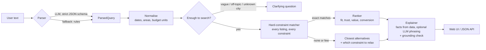

# SpaceScout: natural-language search for a coworking marketplace

Type what you need, for example *"Quiet place for 4 people in Bandra tomorrow afternoon, fast wifi, under ₹600 per person per hour, ideally with a whiteboard"*, and get ranked results from a fixed set of listings. Each result says why it fits and what it trades off. Vague, conflicting or impossible requests get a clarifying question or the closest real alternatives, never invented listings.

**Deliverables in this repo**

| Assignment deliverable | Where |
|---|---|
| Working prototype (web UI) + run instructions | `app/`, `static/`, this README |
| Design note (1-2 pages) | [`DESIGN_NOTE.md`](DESIGN_NOTE.md) |
| Evaluation (21 queries, 9 messy/adversarial) | [`EVALUATION.md`](EVALUATION.md), `eval/` |
| Reflection (three shipping risks) | [`REFLECTION.md`](REFLECTION.md) |

## Run it

Requires Python 3.10+.

```bash
python -m venv .venv && source .venv/bin/activate      # Windows: .venv\Scripts\activate
pip install -r requirements-dev.txt
cp .env.example .env                                  # add GROQ_API_KEY to enable the LLM parser
uvicorn app.main:app --reload
```

Open http://127.0.0.1:8000. API docs are at http://127.0.0.1:8000/docs.

The app also runs **without an API key**: it then uses the rule-based parser, and the header shows "LLM off". This keeps the demo working if the LLM provider is down, and gives the evaluation a baseline.

```bash
pytest                                    # unit + API tests (LLM calls are mocked)
python -m eval.run_eval --parser rules    # evaluation, offline
python -m eval.run_eval --parser llm      # evaluation with the LLM parser (needs a key)
python scripts/generate_listings.py       # regenerate the dataset (deterministic)
```

## How it works



**The LLM is used in two bounded places. Code makes every decision about which listings to show.**

| Step | Who | Why |
|---|---|---|
| Understand the request | LLM (`openai/gpt-oss-20b` on Groq, strict JSON schema) with a rule-based fallback | Language is messy: typos, Hinglish, "ideally" vs "must". The LLM maps it to a fixed schema and never sees listing data. |
| Dates, time windows, locations, budget units | Code | "Tomorrow afternoon" and ₹/person vs ₹/room arithmetic must be exact and testable. |
| Filtering on hard constraints | Code | Must be correct every time. A listing either fits 4 people or it doesn't. |
| Ranking | Code | Weights must be explicit and auditable, and the same query must give the same order. |
| Explanations | Code builds the facts; the LLM may rephrase them | Any number, amenity or noise claim not in the facts is rejected and the template text is used. |

More detail and trade-offs are in [`DESIGN_NOTE.md`](DESIGN_NOTE.md).

## API

| Method | Path | Purpose |
|---|---|---|
| `POST` | `/api/search` | Natural-language search |
| `GET` | `/api/listings` | All listings (the only data results can come from) |
| `GET` | `/api/listings/{id}` | One listing, 404 if unknown |
| `GET` | `/api/health` | Status, listing count, whether the LLM is configured |

`POST /api/search` request:

```json
{ "query": "Meeting room for 6 in BKC tomorrow morning",
  "reference_time": "2026-10-05T10:00:00+05:30",
  "parser": "auto",
  "limit": 5 }
```

`reference_time` is optional; it fixes "now" so relative dates are reproducible. `parser` is `auto` (LLM if a key is set), `llm` or `rules`. The query is limited to 500 characters; invalid input returns `422` with field-level messages.

Response (abridged, real output from the rule-based parser):

```json
{
  "status": "ok",
  "interpretation": [
    {"kind": "hard", "label": "Area: BKC"}, {"kind": "hard", "label": "6 people"},
    {"kind": "hard", "label": "Meeting room"}, {"kind": "hard", "label": "Tue 06 Oct, 08:00–12:00 (2h)"},
    {"kind": "assumption", "label": "Assumed a 2-hour slot within the morning"}
  ],
  "results": [{
    "listing": {"id": "L011", "name": "Kora Commons BKC", "capacity": 6, "price_per_hour": 1750, "...": "..."},
    "match": "exact",
    "score": {"fit": null, "trust": 0.778, "value": 0.372, "conversion": 1.0, "total": 71.2},
    "price_per_person_hour": 291.7,
    "why": ["Seats 6, enough for your 6", "Free Tue 06 Oct, 08:00–10:00"],
    "tradeoffs": [],
    "explanation": "Seats 6, enough for your 6; free Tue 06 Oct, 08:00–10:00. No notable trade-offs for your request.",
    "explanation_source": "template"
  }],
  "total_exact_matches": 3,
  "trace": {"parser": "rules (no LLM key configured)", "timings_ms": {"parse": 5.7, "match_rank": 1.0, "total": 6.8}}
}
```

`status` is one of:

- `ok`: exact matches found.
- `partial`: fewer than three exact matches, so close alternatives are added and labelled.
- `no_exact_match`: only alternatives, each listing exactly which constraint it misses, plus the single relaxation that would help most.
- `needs_clarification`: vague, off-topic or outside Mumbai; a question is asked and nothing is ranked.

## Project structure

```
app/
  main.py                 FastAPI app, request IDs, JSON logs, serves the UI
  config.py               environment-based settings (no secrets in code)
  api/routes.py           thin HTTP layer
  core/models.py          Pydantic models: Listing, ParsedQuery, ResolvedQuery, API schemas
  core/vocab.py           controlled vocabularies: amenities, areas (with coordinates), time windows
  data/listings.json      40 synthetic listings
  data/repository.py      loads and validates the dataset
  services/
    llm_client.py         OpenAI-compatible client: timeouts, retries, strict-schema fallback
    parser_llm.py         prompt + JSON schema + validation + one repair retry + cache
    parser_rules.py       offline fallback parser
    normalize.py          relative dates, time windows, location resolution, budget units
    availability.py       opening hours and recurring bookings
    matcher.py            hard constraints with costed violations
    ranker.py             scoring: fit, trust (Bayesian), value, conversion
    explainer.py          fact sheets, template text, LLM phrasing + grounding check
    search.py             orchestration and clarification / no-match logic
static/                   single-page UI (vanilla JS, no build step)
eval/                     queries.json, run_eval.py, generated results
tests/                    unit, failure-mode (mocked LLM) and API tests
scripts/generate_listings.py
```

## Configuration

| Variable | Default | Notes |
|---|---|---|
| `GROQ_API_KEY` / `LLM_API_KEY` | unset | Without it the rule-based parser is used |
| `LLM_BASE_URL` | `https://api.groq.com/openai/v1` | Any OpenAI-compatible endpoint |
| `LLM_MODEL` | `openai/gpt-oss-20b` | Must support JSON output; strict schema preferred |
| `LLM_TIMEOUT_S` | `10` | Per HTTP attempt |
| `LLM_STRICT_SCHEMA` | `true` | Falls back to JSON mode automatically if the provider rejects the schema |
| `EXPLAIN_WITH_LLM` | `true` | Set `false` for template-only explanations (one LLM call per search instead of two) |
| `APP_TIMEZONE` | `Asia/Kolkata` | Used to resolve "today" / "tomorrow" |

## The data

`app/data/listings.json` holds 40 fictional listings across 10 Mumbai areas: hot desks, meeting rooms and private cabins. Each has price, capacity, amenities, noise level, Wi-Fi speed, rating, review count, instant-book, opening hours and recurring bookings. It is generated deterministically by `scripts/generate_listings.py`. Four listings are hand-tuned (`OVERRIDES` in the script) so the assignment's example query has meaningful trade-offs. Two more cover the few-reviews and no-reviews cases.

Availability is a weekly pattern (opening days and hours, minus recurring bookings), so the prototype works on any date. A real system would query live bookings; see `REFLECTION.md`.

## Known limitations

- Availability is simulated, not live.
- Locations are resolved against a small gazetteer of Mumbai areas with straight-line distances, not travel time.
- The rule-based parser handles common English phrasings only. It is a fallback, not a substitute: see the Hinglish and typo cases in the evaluation.
- The ranking weights are hand-set and not learned from booking data, which the prototype doesn't have.
- No authentication or rate limiting. The API is a local prototype.
